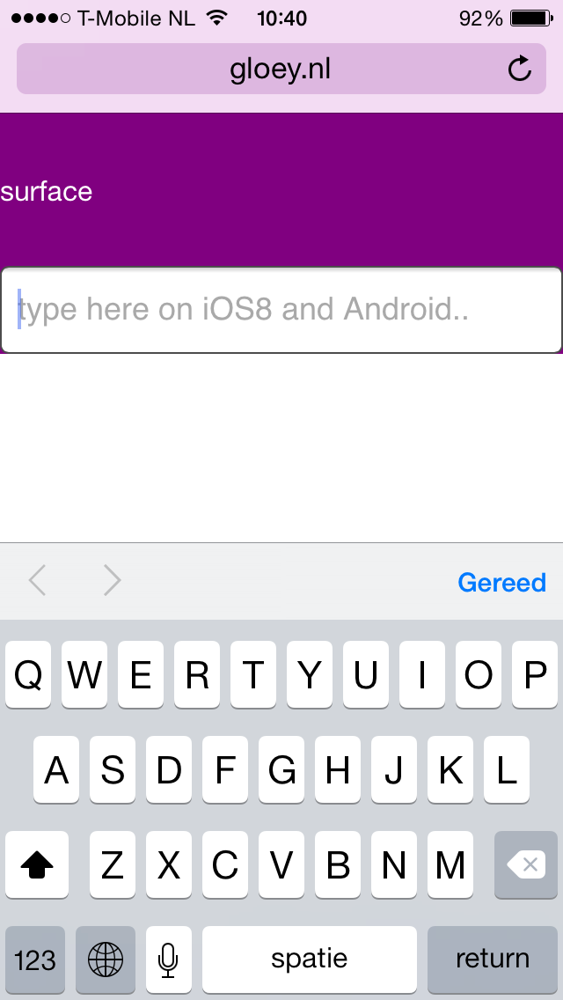
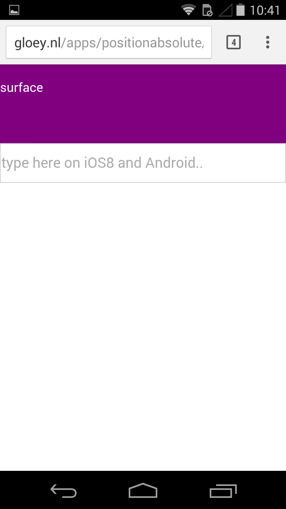

famous-test-positionabsolute
================

Test for absolute positioning issue when showing keyboard on mobile (iOS & android) 

###[Run the demo here](https://rawgit.com/IjzerenHein/famous-test-positionabsolute/master/dist/index.html)


## Issue

When the virtual keyboard is shown on iOS and Android, and there are hidden surfaces below the bottom of the screen (e.g. when using a Scrollview), the window scrolloffset gets misplaced.






# Resolution

To resolve this issue the following line needs to be added to the body tag:

```css
body {
    position: absolute;
}
```


## Contact
- 	@IjzerenHein
- 	http://www.gloey.nl
- 	hrutjes@gmail.com

© 2014 - Hein Rutjes
